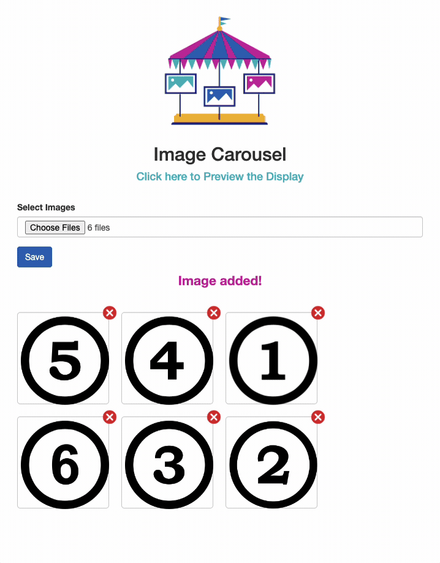

<!-- Begin README -->

    

 

    
    
    
     
    
    
    
     
    
    
    
     
    

---------------

<h1 align="center">Image Carousel</h1>

Upload and Organize Images for Display: This application allows users to upload multiple images and arrange them in a preferred order. After the images are sorted, the application cycles through these organized images stored in a specific directory, presenting them in a sequential display for informational or decorative purposes.

    
     
    <i>Upload and sort images.</i>

 

    
     
    <i>View the images in a carousel on a display.</i>

---------------

## Table of Contents

- [Getting Started](#getting-started)
- [Resources](#resources)
- [License](#license)
- [Credits](#credits)

## Getting Started

1. Clone the repository to your local machine.
2. Move the repository to your web server's root directory (such as XAMPP's htdocs folder).
3. Start your web server and navigate to the upload image interface in your web browser.

    ``ex. http://localhost/javascript-image_carousel/index.html``
4. Click the **Choose Files** button to select the images you want to upload.
5. Rearrange the images in the order you want them to be displayed.
6. Click **Save** to upload the images to the server.
    - The images will be saved to the ``src/uploads`` directory.
7. Navigate to the full ``display.php`` web server address in your web browser.

    ``ex. http://localhost/javascript-image_carousel/src/php/display.php``
8. The images will be displayed in the order you arranged them in the previous step.
9. Update the `src/config/config.ini` file to adjust the directory paths, image file extensions, and seconds the carousel flips through the images.

> [!NOTE]
> This project is an extension of my [PHP Display Solution](https://github.com/scottgriv/php-display_solution) project, which is a simple script that cycles through image files in a declared directory for informative displays. The [Image Carousel](https://github.com/scottgriv/javascript-image_carousel) project adds the ability to upload and organize images for display without having to manually edit the file names in their directory.

> [!WARNING]
> Currently, the ability to retrieve previously uploaded images is not available. If you want to change the images being displayed, you will need to upload new images and arrange them in the order you want them to be displayed.
> There is also a known bug when reordering the images and saving them, without touching the images and dragging them, the number may not get correctly set in the `uploads` folder, as well as the renumbering text displayed in the UI when dragging (its not being renumbered correctly)
> I will work on fixing the above in the future. Feel free to submit a pull request if you would like to contribute to this project and add the above features.

## Resources

- [JavaScript](https://www.javascript.com/)
- [HTML](https://www.w3schools.com/html/)
- [CSS](https://www.w3schools.com/css/)
- [PHP](https://www.php.net/)
- [jQuery](https://jquery.com/)
- [XAMPP](https://www.apachefriends.org/index.html)

## License

This project is released under the terms of the **MIT License**, which permits use, modification, and distribution of the code, subject to the conditions outlined in the license.
- The [MIT License](https://choosealicense.com/licenses/mit/) provides certain freedoms while preserving rights of attribution to the original creators.
- For more details, see the [LICENSE](LICENSE) file in this repository. in this repository.

## Credits

**Author:** [Scott Grivner](https://github.com/scottgriv)  
**Email:** [scott.grivner@gmail.com](mailto:scott.grivner@gmail.com)  
**Website:** [scottgrivner.dev](https://www.scottgrivner.dev)  
**Reference:** [Main Branch](https://github.com/scottgriv/javascript-image_carousel)  

---------------

    

<!-- End README -->
